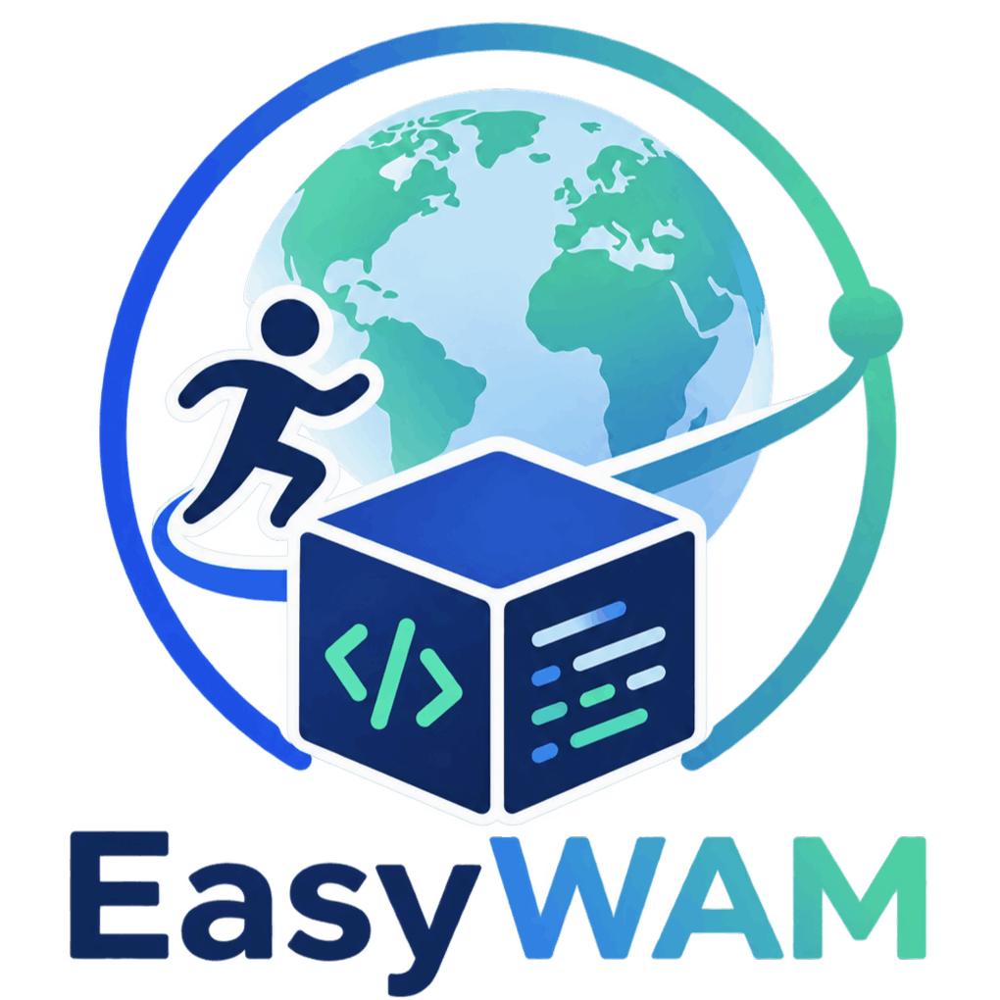
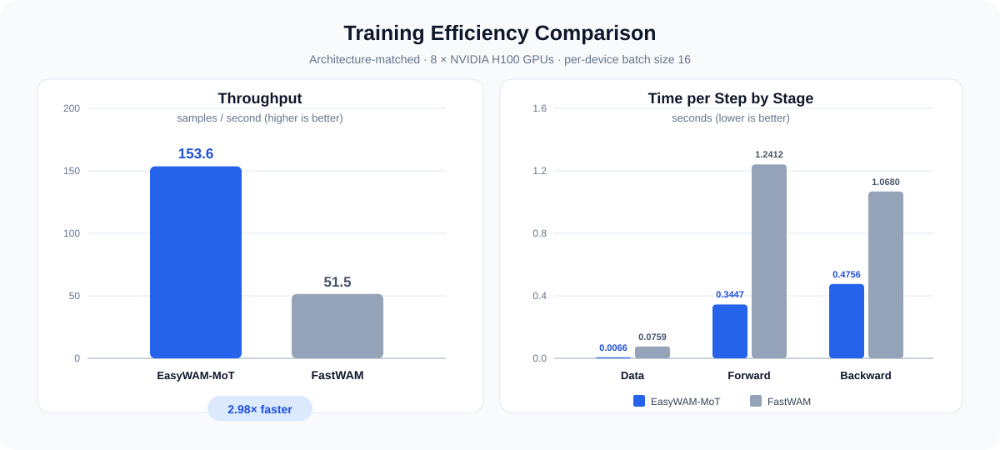

<p align="center">
  
</p>

<h1 align="center">🚀 EasyWAM: An Efficient and Easy-to-Use Codebase for World Action Model</h1>

<p align="center">用于训练与评测 World Action Model 的统一研究代码库。</p>

<p align="center">
  <a href="./README.md"></a>
  <a href="./README_zh.md"></a>
  <a href="https://openmoss.github.io/EasyWAM/"></a>
  <a href="https://huggingface.co/collections/OpenMOSS-Team/easywam"></a>
  <a href="https://github.com/OpenMOSS/EasyWAM/issues/1#issue-5314445304"></a>
</p>

## ✨ 概览与主要特性

EasyWAM 是一个统一的 World Action Model 研究代码库，旨在让模型开发更加高效、可复现且易于扩展。项目通过一致的工作流连接模型实现、数据处理、分布式训练、参数高效微调和大规模评测。

<p align="center">
  
</p>

- ⚡ **高效计算：** 计算效率是 EasyWAM 的核心设计目标。项目原生集成 **FlashAttention 2/3/4** 以加速 Attention 计算，并提供覆盖参数高效训练、checkpoint 保存到合并推理的完整 **LoRA** 支持；BF16、gradient checkpointing、DeepSpeed ZeRO 和 PyTorch SDPA 回退进一步兼顾速度、显存占用与兼容性。
- 🚄 **端到端管线优化：** EasyWAM 对训练与推理的每个阶段进行系统优化。稀疏视频解码、索引式文本缓存、常驻 worker、prompt cache 和断点续评可以消除重复开销，从而显著提升 **训练和推理** 速度。
- 🧩 **统一且易扩展的设计：** 模块化模型组件共用一致的数据、训练、checkpoint 和评测接口，便于接入新的 WAM 设计。
- 🛠️ **简单易用的工作流：** Hydra 配置、标准化训练与评测方案、分布式 launcher、自动 GPU 分片和结果汇总让常用流程更加直接。

> 🌟 **愿景：** 我们希望 EasyWAM 成为一个高效且易用的 WAM 研究代码库，帮助研究者更快、更轻松地开展 World Action Model 研究。未来我们将持续更新并支持更多模型与 benchmark，也诚挚欢迎社区贡献者加入，共同让 EasyWAM 变得更好。如果在使用过程中遇到任何问题，或对 EasyWAM 有任何改进建议，欢迎提交 Issue；我们会持续完善 EasyWAM。

## 📰 最新动态

- **[2026-08]** EasyWAM 正式发布，为 World Action Model 提供统一的训练与评测工作流。

## 🤖 支持的模型与 Benchmark

### 🧠 模型

- **EasyWAM-Unified：** 采用单主干架构，将视频、动作和机器人状态 token 输入同一个 Video DiT，联合预测未来视频与动作。该架构参考 [DreamZero](https://github.com/dreamzero0/dreamzero)。
- **EasyWAM-MoT：** 采用双主干架构，使用独立的 Video DiT 和 Action DiT 专家，并通过共享的混合自注意力实现两类 token 的交互。该模型仅进行动作预测，架构参考 [FastWAM](https://github.com/yuantianyuan01/FastWAM)。
- **EasyWAM-MoT-Joint：** 采用双主干架构，通过共享的混合自注意力联合去噪视频和动作 token。
- **EasyWAM-MoT-IDM：** 采用双主干架构，使用 teacher-forcing 条件视频进行动作预测。
- **EasyWAM-Hidden：** 采用双主干架构，将 Video DiT 的中间特征作为独立 Action DiT 的条件输入。该架构参考 [DiT4DiT](https://github.com/Mondo-Robotics/DiT4DiT)。

| 模型 | 全参数训练 | LoRA 微调 |
| --- | :---: | :---: |
| EasyWAM-Unified | ✅ | ✅ |
| EasyWAM-MoT | ✅ | ✅ |
| EasyWAM-MoT-Joint | ✅ | ✅ |
| EasyWAM-MoT-IDM | ✅ | ✅ |
| EasyWAM-Hidden | ✅ | ✅ |

### 🏗️ Backbone

| Backbone | 支持情况 |
| --- | :---: |
| Wan2.2-TI2V-5B | ✅ |
| Cosmos-Predict2.5-2B | ✅ |
| FLUX.2 Klein-4B（兼容 ImageWAM） | ✅ |

checkpoint 迁移、配置和评测方式请参阅
[FLUX.2 / ImageWAM backbone 接入文档](docs/instructions/flux2_imagewam_integration.md)。

### 🧪 Benchmark

| Benchmark | 训练 | 评测 |
| --- | --- | --- |
| LIBERO | 全参数训练和 LoRA | 标准四 suite 评测 |
| LIBERO-Plus | 使用 LIBERO checkpoint | 鲁棒性评测 |
| RoboTwin | 全参数训练和 LoRA | Clean 和 randomized 评测 |

## 🏆 Benchmark 结果

> 以下所有 Benchmark 结果均使用 **Wan2.2-TI2V-5B** 作为 backbone。

<details open>
<summary><b>LIBERO</b></summary>

**全参数训练**

| 模型 | Spatial | Object | Goal | LIBERO-10 | 平均 |
| --- | :---: | :---: | :---: | :---: | :---: |
| EasyWAM-Unified | 99.0 | 99.4 | 99.2 | 98.2 | 99.0 |
| EasyWAM-MoT | 97.8 | 98.4 | 97.6 | 95.6 | 97.4 |
| EasyWAM-Hidden | 99.4 | 100.0 | 97.0 | 97.8 | 98.6 |

**LoRA（Rank 128）**

| 模型 | Spatial | Object | Goal | LIBERO-10 | 平均 |
| --- | :---: | :---: | :---: | :---: | :---: |
| EasyWAM-Unified | 84.0 | 97.8 | 92.0 | 81.2 | 88.8 |
| EasyWAM-MoT | 96.8 | 98.8 | 94.4 | 90.4 | 95.1 |
| EasyWAM-Hidden | 96.8 | 99.4 | 92.6 | 86.8 | 93.9 |

</details>

<details open>
<summary><b>LIBERO-Plus</b></summary>

| 模型 | Orig（LIBERO） | Background | Camera | Language | Layout | Light | Noise | Robot | 平均 |
| --- | :---: | :---: | :---: | :---: | :---: | :---: | :---: | :---: | :---: |
| EasyWAM-Unified | 99.0 | 55.8 | 33.7 | 93.7 | 80.6 | 92.2 | 50.2 | 71.4 | 67.5 |
| EasyWAM-MoT | 97.4 | 52.8 | 20.6 | 80.4 | 65.2 | 85.1 | 51.5 | 49.7 | 56.8 |
| EasyWAM-Hidden | 98.6 | 56.8 | 49.2 | 95.3 | 81.0 | 90.4 | 58.2 | 77.4 | 72.4 |

</details>

我们撰写了一篇 blog，对上述实验结果进行分析：[什么样的 WAM 架构是我们需要的？](docs/blogs/blog01_arch_zh.md)（[English](docs/blogs/blog01_arch.md)）。

## ⚡ 效率结果

> 以下所有效率结果均使用 **Wan2.2-TI2V-5B** 作为 backbone。**实际训练时长会随 CPU 和 GPU 配置而变化，以上数据仅供参考。** 请参阅[效率配置指南](docs/configurations/efficiency_zh.md)，根据自己的机器选择合适的配置，以提升训练与推理效率。

EasyWAM-MoT 与 FastWAM 使用相同的模型架构，因此可以在架构一致的条件下对比 EasyWAM 训练框架与 FastWAM 原始代码框架。在 **8 × NVIDIA H100 GPUs**、**per-device batch size 为 16** 的配置下，EasyWAM-MoT 的吞吐量达到 **121.9 samples/s**，是 FastWAM（51.5 samples/s）的 **2.37 倍**；每 step 的数据读取、前向传播和反向传播耗时分别降低 **66.0%**、**58.4%** 和 **54.7%**。

<p align="center">
  
</p>

| 代码框架 | 吞吐量（samples/s）↑ | 数据读取耗时（s）↓ | 前向传播耗时（s）↓ | 反向传播耗时（s）↓ |
| --- | :---: | :---: | :---: | :---: |
| EasyWAM-MoT | **121.9** | **0.0258** | **0.5162** | **0.4842** |
| FastWAM | 51.5 | 0.0759 | 1.2412 | 1.0680 |

在 LIBERO 数据集上训练 **20,000 steps**，EasyWAM 约需 **6 小时**，而使用 FastWAM 原始代码框架约需 **14 小时**，整体训练时长缩短约 **57.1%**。

> 🌟 **愿景：** World Action Model 的训练与评测通常需要大量计算资源。EasyWAM 希望通过高效且轻量的代码框架降低这一研究门槛，让研究者即使在计算资源有限的情况下，也能完成模型训练与评测、快速验证想法并持续迭代。通过不断优化效率，我们希望研究者能够将更多资源投入模型与算法创新，也让更多社区成员参与到 WAM 研究中。

## 🚀 快速开始

### 🛠️ 安装环境

```bash
conda create -n easywam python=3.10 -y
conda activate easywam
pip install -U pip
pip install torch==2.7.1+cu128 torchvision==0.22.1+cu128 \
  --extra-index-url https://download.pytorch.org/whl/cu128
pip install -e .
```

[FlashAttention](https://github.com/Dao-AILab/flash-attention) 是可选依赖。安装后，EasyWAM 会使用当前环境中最快的兼容实现；无法使用时则回退到 PyTorch SDPA。

### 📦 准备模型

已发布的 EasyWAM checkpoint 可从 Hugging Face 的 [OpenMOSS-Team/EasyWAM 模型集合](https://huggingface.co/collections/OpenMOSS-Team/easywam) 下载。各 checkpoint 的具体下载命令和使用要求请参阅对应的 [model cards](model_cards/)。

请在项目根目录运行以下命令。下载位置与
`configs/model/backbone/wan22.yaml`、`configs/model/backbone/cosmos25.yaml`
中的默认路径一致。

```bash
mkdir -p checkpoints

# Wan2.2 Video DiT、VAE、UMT5 encoder 和 tokenizer
huggingface-cli download Wan-AI/Wan2.2-TI2V-5B --local-dir checkpoints/Wan2.2-TI2V-5B

# Cosmos post-trained 2B Video DiT 和对应的 Wan2.1 video tokenizer
huggingface-cli download nvidia/Cosmos-Predict2.5-2B \
  --include "base/post-trained/81edfebe-bd6a-4039-8c1d-737df1a790bf_ema_bf16.pt" "tokenizer.pth" \
  --local-dir checkpoints/Cosmos-Predict2.5-2B

# 用于生成 Cosmos 文本缓存的 Reason1 text encoder 和 tokenizer
huggingface-cli download nvidia/Cosmos-Reason1-7B --local-dir checkpoints/Cosmos-Reason1-7B
```

完成下载并生成 ActionDiT 初始化权重后，默认配置实际使用以下文件：

```text
checkpoints/
├── Wan2.2-TI2V-5B/
├── Cosmos-Predict2.5-2B/
│   ├── base/post-trained/81edfebe-bd6a-4039-8c1d-737df1a790bf_ema_bf16.pt
│   └── tokenizer.pth
├── Cosmos-Reason1-7B/
├── ActionDiT_Wan22_5B_alphascale_1024hdim.pt
└── ActionDiT_CosmosPredict25_2B_alphascale_1024hdim.pt
```

EasyWAM-MoT 和 EasyWAM-Hidden 还需要经过插值初始化的 ActionDiT 权重：

```bash
# 输出路径与 configs/model/backbone/wan22.yaml 完全一致
python scripts/preprocess_action_dit_backbone.py \
  --model-config configs/model/easywam_mot_wan22.yaml \
  --backbone wan22 \
  --output checkpoints/ActionDiT_Wan22_5B_alphascale_1024hdim.pt \
  --device cuda \
  --dtype bfloat16

# 输出路径与 configs/model/backbone/cosmos25.yaml 完全一致
python scripts/preprocess_action_dit_backbone.py \
  --model-config configs/model/easywam_mot_cosmos25.yaml \
  --backbone cosmos25 \
  --output checkpoints/ActionDiT_CosmosPredict25_2B_alphascale_1024hdim.pt \
  --device cuda \
  --dtype bfloat16
```

EasyWAM-Unified 不需要该 ActionDiT checkpoint。

### 📝 预计算文本特征

准备好 benchmark 数据后执行一次：

```bash
python scripts/precompute_text_embeds.py task=libero_easywam_mot_wan22
# 或：python scripts/precompute_text_embeds.py task=robotwin_easywam_mot_wan22
python scripts/precompute_text_embeds.py task=libero_easywam_mot_cosmos25
```

### 🏋️ 训练

训练脚本直接接收 Hydra overrides，通过 `NPROC_PER_NODE` 设置本机进程数：

```bash
# 8 张本机 GPU，DeepSpeed ZeRO-1
NPROC_PER_NODE=8 bash scripts/train_zero1.sh task=libero_easywam_mot_wan22

# MoT、MoT-Joint 和 MoT-IDM 均有对应的 Cosmos25 task 配置
NPROC_PER_NODE=8 bash scripts/train_zero1.sh \
  task=libero_easywam_mot_cosmos25

# 4 张本机 GPU，DeepSpeed ZeRO-2 LoRA 训练
NPROC_PER_NODE=4 bash scripts/train_zero2.sh task=robotwin_easywam_unified_wan22_lora
```

`scripts/train_zero2_offload.sh` 启用 ZeRO-2 CPU Offload。多机训练还需设置 `NNODES`、`NODE_RANK`、`MASTER_ADDR` 和 `MASTER_PORT`。

### 📊 评测

```bash
# LIBERO
python experiments/libero/run_libero_manager.py \
  task=libero_easywam_mot_wan22 \
  ckpt=<path/to/checkpoint.pt>

# LIBERO-Plus（使用 LIBERO checkpoint）
python experiments/libero_plus/run_libero_plus_manager.py \
  task=libero_easywam_mot_wan22 \
  ckpt=<path/to/checkpoint.pt>

# RoboTwin
python experiments/robotwin/run_robotwin_manager.py \
  task=robotwin_easywam_mot_wan22 \
  ckpt=<path/to/checkpoint.pt>
```

manager 默认使用 8 张 GPU。可通过 `MULTIRUN.num_gpus` 和 `MULTIRUN.max_tasks_per_gpu` 适配实际机器。环境安装、数据目录、已发布权重、任务筛选和断点恢复等内容见对应 benchmark 指南。

## 📚 文档

| 文档 | English | 中文 |
| --- | --- | --- |
| 文档索引 | [Index](docs/README.md) | [文档索引](docs/README_zh.md) |
| 配置 | [Guide](docs/configurations/README.md) | [配置指南](docs/configurations/README_zh.md) |
| LIBERO | [Guide](docs/instructions/libero.md) | [使用指南](docs/instructions/libero_zh.md) |
| LIBERO-Plus | [Guide](docs/instructions/libero_plus.md) | [使用指南](docs/instructions/libero_plus_zh.md) |
| RoboTwin | [Guide](docs/instructions/robotwin.md) | [使用指南](docs/instructions/robotwin_zh.md) |

## 🗂️ 项目结构

```text
EasyWAM/
├── configs/          # 数据、模型、task、训练及评测配置
├── docs/             # 项目文档
│   ├── README.md      # 文档索引
│   ├── blogs/        # 架构博客
│   ├── configurations/ # 配置指南
│   └── instructions/   # 集成与 Benchmark 使用指南
├── experiments/      # Benchmark 评测器
├── scripts/          # 训练、预处理和缓存入口
├── src/              # 模型、数据管线、runtime 和 trainer
├── checkpoints/      # 外部及训练得到的 checkpoint
├── data/             # 本地数据集和文本缓存
└── runs/             # 训练输出
```

## 🤝 参与贡献

EasyWAM 由社区共同建设。你可以通过修复 bug、改进文档、支持新的模型或 benchmark，或分享帮助降低 World Action Model 研究门槛的想法来参与其中。

- **报告 bug：** 请在 [Issue](https://github.com/OpenMOSS/EasyWAM/issues) 中提供复现步骤、配置详情和相关日志。
- **提出功能或改进建议：** 对于较大的改动，请先创建 Issue 讨论范围和实现方案。
- **提交 Pull Request：** 保持改动聚焦，必要时同步更新文档，并说明验证方式。

我们很高兴接受任何形式的贡献。如果你希望参与贡献、与我们交流，或共同建设 EasyWAM，欢迎发送邮件至 [siyinwang20@fudan.edu.cn](mailto:siyinwang20@fudan.edu.cn)。详细贡献指南请参阅 [docs/CONTRIBUTING.md](docs/CONTRIBUTING.md)。

## 🙏 致谢

本项目的代码基于[FastWAM](https://github.com/yuantianyuan01/FastWAM)构建,并参考 [DreamZero](https://github.com/dreamzero0/dreamzero) 和 [DiT4DiT](https://github.com/Mondo-Robotics/DiT4DiT) 的模型设计。我们由衷感谢以上团队对开源社区的宝贵贡献。

## 📝 Citation

我们欢迎在研究中引用 **EasyWAM** 的实验结果与代码库。如果 **EasyWAM** 对你的研究有所帮助，请引用：

```bibtex
@misc{easywam2026,
  title  = {EasyWAM: A Unified and Efficient Framework for Training and Evaluating World Action Models},
  author = {EasyWAM-Team},
  year   = {2026},
  url    = {https://github.com/OpenMOSS/EasyWAM}
}
```
